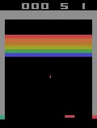
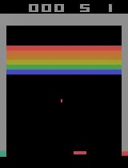
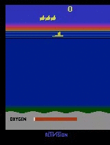
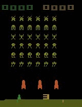
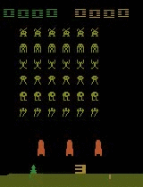
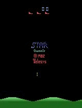
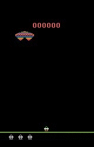

# Distributed A3C algorithm for playing Atari games
This repo contains the code for our work on the distributed training of RL agents for playing atari games. For further details please read our paper on the subject: https://arxiv.org/abs/1801.02852 or visit our blog [Solving Atari games with Distributed Reinforcement Learning](https://blog.deepsense.ai/solving-atari-games-with-distributed-reinforcement-learning/).
It's a distributed version of the A3C algorithm in [Asynchronous Methods for Deep Reinforcement Learning](http://arxiv.org/abs/1602.01783).  
We based our implementation on [Tensorpack version of A3C](https://github.com/ppwwyyxx/tensorpack/tree/master/examples/A3C-Gym).  
It's prepared to run on large CPU clusters with [Slurm](https://slurm.schedmd.com/) manager (it was tested on up to 1500 cores)

# Requirements
* Python 2.7.13
* Slurm 17.02.7
* Tensorflow 1.2
* other Python requirements as described [here](requirements.txt)
 
## Notes
* In our experiments we've used [Tensorflow with MKL](https://software.intel.com/en-us/articles/intel-optimized-tensorflow-wheel-now-available). Our code should work with usual TensorFlow 1.2, but we neither tested nor have any benchmarks for it.

# Install
1. `git clone https://github.com/deepsense-ai/Distributed-BA3C.git`
2. Create virtualenv: `virtualenv a3c_virtualenv`
3. Activate virtualenv: `source a3c_virtualenv/bin/activate`
4. Install Python packages: `pip install -r Distributed-BA3C/requirements.txt`
5. In [`distributed_tensorpack_mkl.sh:38`](src/distributed_tensorpack_mkl.sh) set these paths:  
* EXPERIMENTS_DIR - directory where experiments will be saved, e.g. `mkdir experiments`  
* VIRTUAL_ENV - path to `a3c_virtualenv` you will be using
* DISTRIBUTED_A3C_PATH - path to `Distributed-BA3C` (this repo)
* TENSORPACK_PIPEDIR - path to a directory for storing sockets which are used for interprocess communication, e.g. `mkdir tmp_sockets`

# To train agent on Atari game:
Minimal command to start training:
```bash
python run_job.py -n 68 -g 60 -c 12 --use_sync --name neptune_job_name 
```

To reproduce our best results use:
```bash
python run_job.py -n 71 -g 60 -c 12 -o adam --use_sync --name neptune_job_name -l 0.001 -b 32 --fc_neurons 128 --simulator_procs 10 --ps 4 --fc_init uniform --conv_init normal --fc_splits 4 --epsilon 1e-8 --beta1 0.8 --beta2 0.75 -e Breakout-v0 --eval_node --record_node --save_every 1000
```

# Games
Below we showcase our solution performance on several Atari 2600 games. Left column is novice performance, middle column is after approx. 15 minutes of training and right is after approx. 30 minutes of training.

<p align="center">
  <b>Breakout</b></br>
  
  
  </br>
</p>  
<p align="center">
  <b>Boxing</b></br>
  
  
  </br>
</p>
<p align="center">
  <b>Seaquest</b></br>
  
  
  </br>
</p>
<p align="center">
  <b>Space Invaders</b></br>
  
  
  </br>
</p>
<p align="center">
  <b>Stargunner</b></br>
  
  
  </br>
</p>
<p align="center">
  <b>Assault</b></br>
  
  
  </br>
</p>
